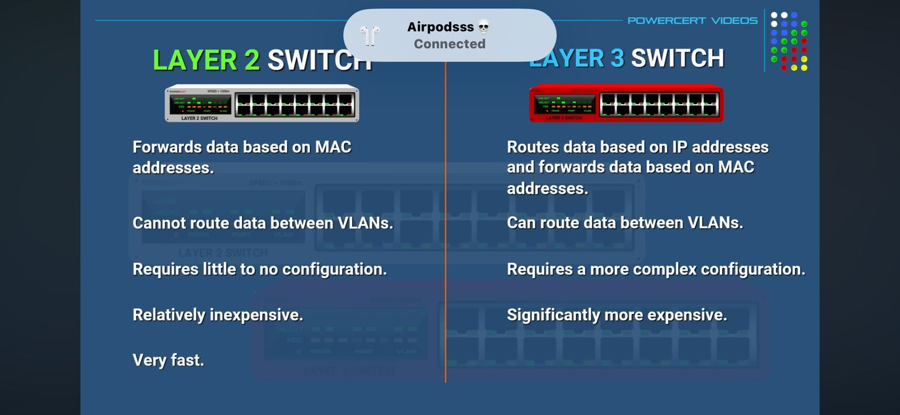

# ONVIF - Universal Standard for Security Cameras

## What is ONVIF?

If you are setting up a home or business security system, look for the ONVIF logo on cameras and NVRs (Network Video Recorders). If both devices are ONVIF-compliant, you can usually plug a Hikvision camera into a Dahua recorder, or use a Bosch camera with Milestone software, and they will work without complex custom coding.

## ONVIF Logo Examples


## Benefits of ONVIF

- **Interoperability**: Mix and match different brands
- **No vendor lock-in**: Freedom to choose best devices
- **Easy integration**: Works without custom programming
- **Industry standard**: Widely supported by major manufacturers

---

# VLANs: Virtual Local Area Networks

Creating Logical Segmentation on a Shared Physical Infrastructure

## What is a VLAN?

A VLAN (Virtual Local Area Network) allows you to logically divide a single physical switch into multiple broadcast domains. This means devices on different VLANs cannot communicate directly, even though they're connected to the same switch - providing security, performance, and flexibility benefits.


## VLAN Configuration Example

### Configuration Commands:

```
Switch(config)# vlan 5
Switch(config-vlan)# name Sales
Switch(config-vlan)# exit
Switch(config)# interface range fa0/1 - 4
Switch(config-if-range)# switchport access vlan 5

Switch(config)# vlan 10
Switch(config-vlan)# name Marketing
Switch(config-vlan)# exit
Switch(config)# interface range fa0/5 - 8
Switch(config-if-range)# switchport access vlan 10
```


## Key VLAN Benefits

- **Security (Isolation)**: Limits broadcast traffic and enhances security
- **Performance (Efficiency)**: Reduces broadcast domains for better network speed
- **Flexibility (Logical Grouping)**: Easily group devices regardless of physical location

- 

## How VLANs Work

1. **Step 1: Access & Configure** - Connect to the managed switch
2. **Step 2: Define the VLAN** - Create VLAN with ID and name
3. **Step 3: Assign Ports to VLAN** - Configure which physical ports belong to the VLAN
4. **Step 4: Verify Configuration** - Check VLAN status with `show vlan brief`

---

# NVR: Network Video Recorder Setup Guide

## What is an NVR?

A Network Video Recorder (NVR) is a specialized computer system that records video from IP cameras to a hard disk drive (HDD). Unlike DVRs that process video at the recorder, NVRs work with IP cameras that encode and process video at the camera level, then stream it to the NVR for storage and viewing.

📄 **[Complete Setup Guide - Download PDF](NVR_Setup_Box_to_Live_View.pdf)**

## Dahua NVR Setup: From Box to Live View

### Hardware Installation

#### Step 1: Install Hard Drive
- Open the NVR chassis
- Mount surveillance-grade HDD (check max capacity: 10TB for 4116, varies for 4216)
- Connect SATA and power cables
- **Pro Tip**: Use surveillance-grade drives optimized for 24/7 recording

#### Step 2: Make Physical Connections
- **Mouse**: Connect USB mouse (front or rear port)
- **Network (LAN)**: Connect to router/switch via Ethernet cable (CRITICAL for remote viewing)
- **Power**: Connect power supply (external 48V for 4116, built-in for 4216)
- **Monitor**: Connect via HDMI or VGA (can use both simultaneously)
- **PoE Camera Ports**: Plug cameras directly for auto-detection and power

- 

### Network Architecture Options


| Scenario | Setup | Use Case |
|----------|-------|----------|
| **A: Standalone** | Cameras → NVR PoE ports only | Local monitor viewing, no network needed |
| **B: Expanded Local** | Cameras → PoE Switch ← NVR | More cameras than NVR ports, PC access on LAN |
| **C: Full Remote** | Cameras → PoE Switch → Router → Internet | Remote viewing from anywhere via phone/web |

### Network Configuration Essentials

**Understanding Your Network Address**:
- **IP Address**: Unique device address (e.g., 192.168.1.108)
- **Subnet Mask**: Network range definition (typically 255.255.255.0)
- **Default Gateway**: Router IP for internet access (e.g., 192.168.1.1)

### Initial Setup Wizard

**Step 1**: Region & Language Selection
**Step 2**: Set Strong Admin Password (8-32 characters)
**Step 3**: Create Unlock Pattern (optional)
**Step 4**: CRITICAL - Set Recovery Email (only way to reset password)
**Step 5**: Device Name & Enable NTP for auto time sync

### Static vs DHCP IP Configuration

✅ **Static IP (Recommended)**:
- IP address never changes
- Reliable remote access
- Example: 192.168.8.253
- Always click "Test" to verify availability

⚠️ **DHCP (Not Recommended)**:
- IP can change on reboot
- Breaks remote access connections
- Only use for temporary setups

### Enable P2P for Easy Remote Access

**What is P2P?**: Peer-to-Peer service allows mobile app to find your NVR without complex port forwarding

**Setup**:
1. Enable P2P in setup wizard
2. Verify status shows "Online"
3. Use QR code to add device to mobile app
4. ⚠️ **Keep QR code and serial number private!**

### Camera Registration

**Automatic Detection**:
- Cameras plugged into NVR PoE ports auto-detect
- NVR uses its admin password to login

**Manual Addition**:
- NVR scans network for Dahua cameras
- Manually add via Camera menu
- If status shows error, verify camera password matches

### Recording Schedule Configuration

**Storage Settings**:
- Set to "Overwrite" mode (auto-deletes oldest footage when full)
- Avoid "Stop Record" (halts all recording when drive full)

**Schedule Options**:
- **Regular (Green)**: 24/7 continuous recording
- **MD (Yellow)**: Motion Detection only (saves space)

**Recommended Setup for Space Saving**:
1. Remove default Regular schedule
2. Enable MD (Motion Detection)
3. Fill entire schedule with MD
4. Use "Copy" to apply to all channels

### Mobile App Setup (gDMSS/iDMSS)

1. Download **gDMSS Plus** (Android) or **iDMSS Plus** (iOS)
2. Open app → Add device
3. Select **SNScan**
4. Scan **Device SN QR code** from NVR monitor (Network → P2P)
5. Start Live View

### Video Streams Explained

| Stream Type | Resolution | Bitrate | Use Case |
|-------------|------------|---------|----------|
| **Main Stream** | Full (1920x1080+) | High | Recording to HDD |
| **Sub Stream** | Lower (D1) | Low | Mobile/remote viewing (less bandwidth) |

**Configuration**: Camera → Encode settings

### PC Access Methods

**Method 1: Web Browser**
- Type NVR IP in browser: `http://192.168.8.253`
- Access: Live view, playback, configuration

**Method 2: Smart PSS Software**
- Download from Dahua website (Windows/macOS)
- Centralized management for multiple NVRs
- Advanced features and controls

---

# SIRA/ADMCC: UAE Security Camera Requirements (C025 Standards)

## Overview


Compliant with **SIRA** (Dubai) and **MCC/ADMCC** (Abu Dhabi) regulations introduced in **Administrative Resolution No. (13) April 2025**.

## SIRA CCTV Network Isolation (VLAN 100)

- [ ] All cameras and NVRs on isolated VLAN (100)
- [ ] Layer 3 managed switch deployed
- [ ] Strong passwords enabled on all devices
- [ ] SSH enabled, Telnet disabled
- [ ] Configuration saved to startup-config
- [ ] Network diagram documented
- [ ] Admin credentials securely stored
- [ ] Regular firmware updates scheduled
- [ ] Access logs monitored

- [ ] 

---

## Key Takeaways

✅ **ONVIF**: Universal standard for camera/NVR interoperability  
✅ **VLANs**: Network segmentation for security and performance  
✅ **NVR**: Complete setup from hardware to mobile viewing  
✅ **SIRA/ADMCC**: UAE compliance with proper network isolation  

**All systems prope

---

# ICT Cabling: Structured Network Infrastructure

Physical Foundation for Data, Voice, CCTV & Access Control Systems


## ICT Cabling Quick Reference

| Section | Topic | Simple Notes |
|---------|-------|-------------|
| 1 | ICT cabling role | Physical network for data, voice, CCTV, access control. |
| 1 | Standards focus | Use Cat6A copper and structured fiber as 2025 base. |
| 2 | Entrance facility | Point where service provider links enter building. |
| 2 | MDF room | Main rack with core switch, router, and backbone links. |
| 2 | TR/IDF room | Floor-wise rack distributing to work areas. |
| 2 | Horizontal cabling | Cat6A runs from TR to outlets, max 90 m. |
| 3 | Copper links | Use for data ports, Wi‑Fi APs, many CCTV. |
| 3 | Fiber links | Use for long distance, inter‑rack and backbone. |
| 4 | Core roles | Structured cabling technician, data‑cabling engineer, ELV/ICT engineer. |
| 4 | Certifications | BICSI Installer 2, Technician (TECH), then advanced RCDD. |
| 4 | Responsibilities | Install and terminate Cat6A/fiber, test, troubleshoot, build racks. |
| 5 | Future sectors | 5G sites, smart buildings, data centers, IoT/surveillance in UAE. |

## Key Infrastructure Components

### Physical Spaces
- **Entrance Facility (EF)**: Service provider demarcation point
- **Main Distribution Frame (MDF)**: Central hub with core networking equipment
- **Telecom Room (TR/IDF)**: Floor distribution points for horizontal cabling
- **Work Area**: End-user connection points (desks, cameras, APs)

### Cabling Standards
- **Horizontal**: Cat6A (up to 90m) for desktop/device connections
- **Backbone**: Fiber optic for inter-floor and building connections
- **Max Distance**: 90m permanent + 10m patch cords = 100m total

### Professional Roles
- **Cabling Technician**: Install, terminate, and test copper/fiber infrastructure
- **ELV Engineer**: Design and supervise low-voltage systems integration
- **BICSI RCDD**: Senior designer for complex data center and campus networks

### UAE Application Sectors
✅ 5G telecom sites and tower infrastructure  
✅ Smart building automation and BMS integration  
✅ Data centers with high-density fiber backbones  
✅ IoT sensor networks and surveillance systems  
✅ Campus and enterprise structured cabling

---

**Complete ELV/ICT documentation ready for deployment!**rly configured and operational!**

---

# PoE: Power over Ethernet Technology

Delivering Power and Data Through a Single Cable


## PoE Quick Reference

| Category | Topic | Simple Notes |
|----------|-------|-------------|
| 1 | PoE purpose | Deliver DC power and data over single Ethernet cable. |
| 1 | Main benefit | Eliminate need for separate power cables and outlets. |
| 2 | PoE standards | IEEE 802.3af (PoE), 802.3at (PoE+), 802.3bt (PoE++/4PPoE). |
| 2 | Power levels | af: 15.4W, at: 30W, bt Type3: 60W, bt Type4: 100W. |
| 3 | Common devices | IP cameras, VoIP phones, Wi-Fi APs, IoT sensors, door locks. |
| 3 | PSE equipment | PoE switches, PoE injectors (midspan), network adapters. |
| 4 | Cable requirement | Cat5e minimum, Cat6/Cat6A recommended for higher power. |
| 4 | Max distance | 100m (328 feet) for standard PoE over copper. |
| 5 | PoE extenders | Extend range beyond 100m by regenerating power and signal. |
| 5 | Use case | Long-distance camera runs, remote sensor networks, outdoor APs. |

## PoE Standards Breakdown

### IEEE 802.3af (PoE)
- **Power**: 15.4W at PSE, 12.95W at device
- **Typical devices**: Basic IP cameras, VoIP phones, simple sensors
- **Voltage**: 44-57V DC

### IEEE 802.3at (PoE+)
- **Power**: 30W at PSE, 25.5W at device
- **Typical devices**: PTZ cameras, dual-radio Wi-Fi APs, video phones
- **Voltage**: 50-57V DC

### IEEE 802.3bt (PoE++ / 4PPoE)
- **Type 3**: 60W at PSE, 51W at device
- **Type 4**: 100W at PSE, 71W at device
- **Typical devices**: High-power PTZ, LED lighting, thin clients, displays
- **Voltage**: 50-57V DC

## PoE System Components

### Power Sourcing Equipment (PSE)
- **PoE Switch**: Integrated PoE ports that supply power and data
- **PoE Injector (Midspan)**: Adds PoE capability to non-PoE switches
- **PoE NVR**: Network video recorders with built-in PoE ports

### Powered Devices (PD)
- **IP Security Cameras**: Most common PoE application
- **Wireless Access Points**: Ceiling-mounted Wi-Fi without power outlets
- **VoIP Phones**: Desktop IP phones powered via network
- **Access Control**: Door locks, card readers, intercoms
- **IoT Sensors**: Temperature, motion, environmental monitoring

## PoE Extenders Explained

### What is a PoE Extender?
A device that receives PoE power and data, then regenerates both to extend the network beyond the standard 100m Ethernet limit.

### Key Features
- **Input**: PoE from PSE (switch/injector)
- **Output**: Regenerated PoE to powered device
- **Extension**: Adds another 100m per extender (can be daisy-chained)
- **Transparent**: No configuration needed, plug-and-play

### Common Applications
- **Parking lot cameras**: Long runs from building to perimeter
- **Outdoor Wi-Fi**: Remote access points in parks or campuses
- **Elevator cameras**: Vertical runs through buildings
- **Agricultural IoT**: Sensors in large farms or greenhouses

## PoE Planning Guidelines

### Power Budget Calculation
1. List all PoE devices and their power requirements
2. Add 20% overhead for cable loss
3. Verify switch total PoE budget supports all devices
4. Example: 16-port switch with 120W budget = avg 7.5W per port

### Cable Selection
- **Cat5e**: Good for PoE (802.3af) up to 100m
- **Cat6/Cat6A**: Required for PoE+ and PoE++ at full distance
- **Quality matters**: Poor cables cause voltage drop and unreliable power

### Installation Best Practices
✅ Label all PoE ports clearly on switches  
✅ Use cable tester to verify all 8 conductors before deployment  
✅ Document power consumption per port for troubleshooting  
✅ Keep firmware updated on PoE switches for power management  
✅ Plan for future power needs (cameras may upgrade to PTZ)

---

**Complete PoE infrastructure guide for efficient power delivery!**
