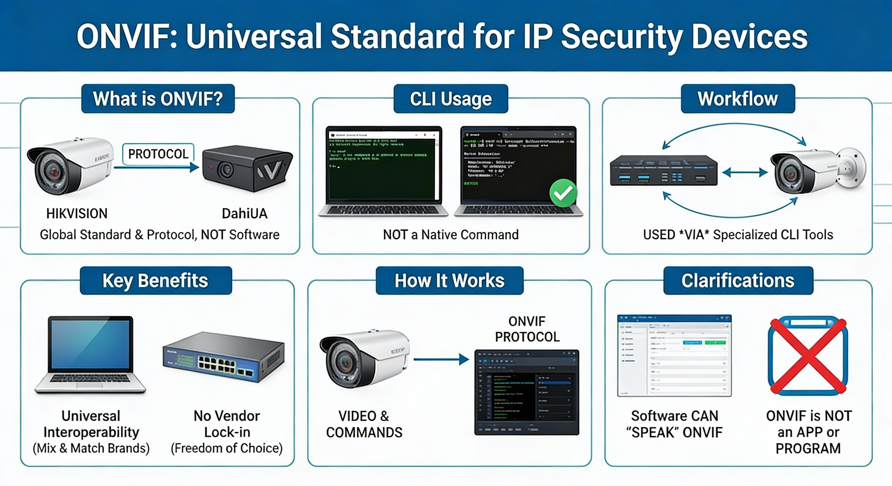
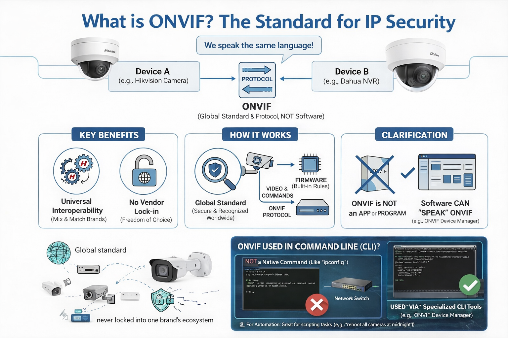
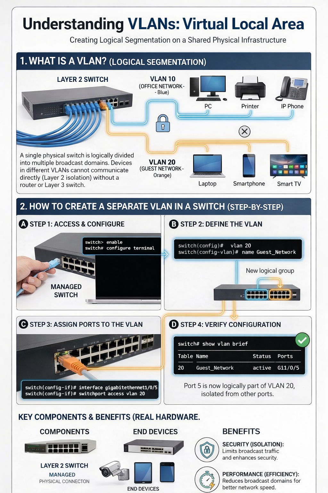
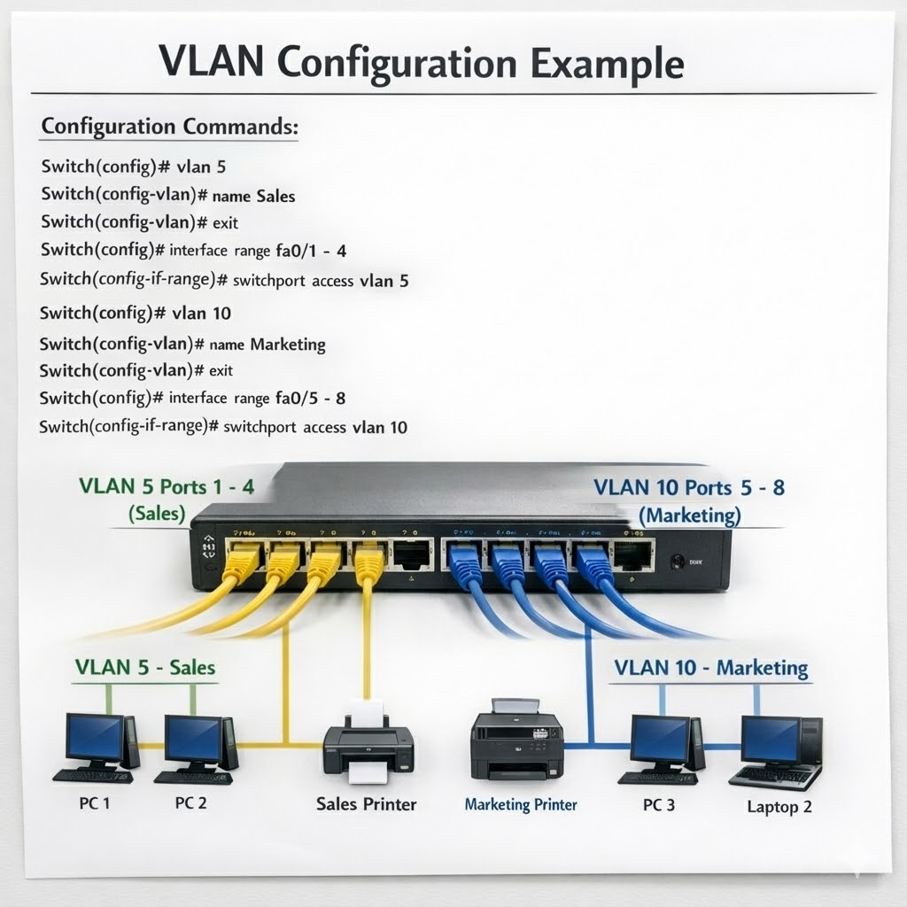

# ONVIF - Universal Standard for Security Cameras

## What is ONVIF?

If you are setting up a home or business security system, look for the ONVIF logo on cameras and NVRs (Network Video Recorders). If both devices are ONVIF-compliant, you can usually plug a Hikvision camera into a Dahua recorder, or use a Bosch camera with Milestone software, and they will work without complex custom coding.

## ONVIF Logo Examples





## Benefits of ONVIF

- **Interoperability**: Mix and match different brands
- **No vendor lock-in**: Freedom to choose best devices
- **Easy integration**: Works without custom programming
- **Industry standard**: Widely supported by major manufacturers

---

# VLANs: Virtual Local Area Networks

Creating Logical Segmentation on a Shared Physical Infrastructure

## What is a VLAN?

A VLAN (Virtual Local Area Network) allows you to logically divide a single physical switch into multiple broadcast domains. This means devices on different VLANs cannot communicate directly, even though they're connected to the same switch - providing security, performance, and flexibility benefits.



## VLAN Configuration Example

### Configuration Commands:

```
Switch(config)# vlan 5
Switch(config-vlan)# name Sales
Switch(config-vlan)# exit
Switch(config)# interface range fa0/1 - 4
Switch(config-if-range)# switchport access vlan 5

Switch(config)# vlan 10
Switch(config-vlan)# name Marketing
Switch(config-vlan)# exit
Switch(config)# interface range fa0/5 - 8
Switch(config-if-range)# switchport access vlan 10
```



## Key VLAN Benefits

- **Security (Isolation)**: Limits broadcast traffic and enhances security
- **Performance (Efficiency)**: Reduces broadcast domains for better network speed
- **Flexibility (Logical Grouping)**: Easily group devices regardless of physical location

## How VLANs Work

1. **Step 1: Access & Configure** - Connect to the managed switch
2. **Step 2: Define the VLAN** - Create VLAN with ID and name
3. **Step 3: Assign Ports to VLAN** - Configure which physical ports belong to the VLAN
4. **Step 4: Verify Configuration** - Check VLAN status with `show vlan brief`
